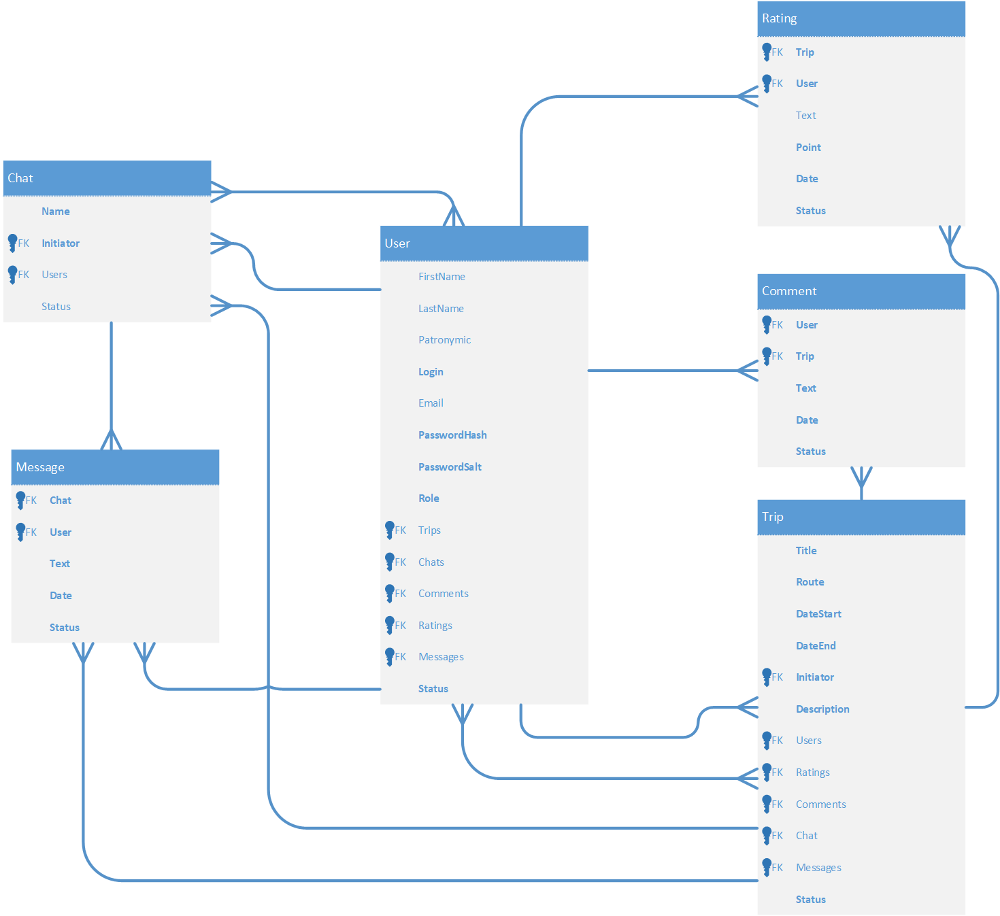

# TravelGod.ru
Веб-приложение на Asp.Net Core Razor Pages, созданное в рамках семестровой работы в 1 семестре 2 курса.

## Краткое описание
Веб-сайт, позволяющий объединяться в группы для совместных туристических поездок.  

## Роли и их взаимодествия с приложением
* Анонимный посетитель может:
  * Просматривать предложенные другими пользователями поездки
  * Фильтровать поездки по некоторым параметрам (маршрут, тип поездки, дата и т.д.)
* Авторизованный пользователь может:
  * Предлагать свои поездки
  * Присоединяться к чужим поездкам
  * Комментировать поездки
  * Оценивать поездку после участия в ней
  * После присоединения к поездке участвовать в общем чате всех присоединившихся к ней пользователей
  * Просматривать историю своих поездок
  * **ВОЗМОЖНО!** Общаться с конкретным пользователем в личном чате
* Модератор может:
  * Удалять нежелательные комментарии, сообщения в чатах, поездки
  * Блокировать нарушителей
* **ВОЗМОЖНО!** Администратор может:
  * Назначать и удалять модераторов

## Страницы
1. Главная
2. Регистрация
3. Вход
4. Профиль
5. История пользователя
6. Предложить поездку
7. Все поездки
8. Описание конкретной поездки
9. Чаты
10. Конкретный чат

## Сущности и связи между ними

